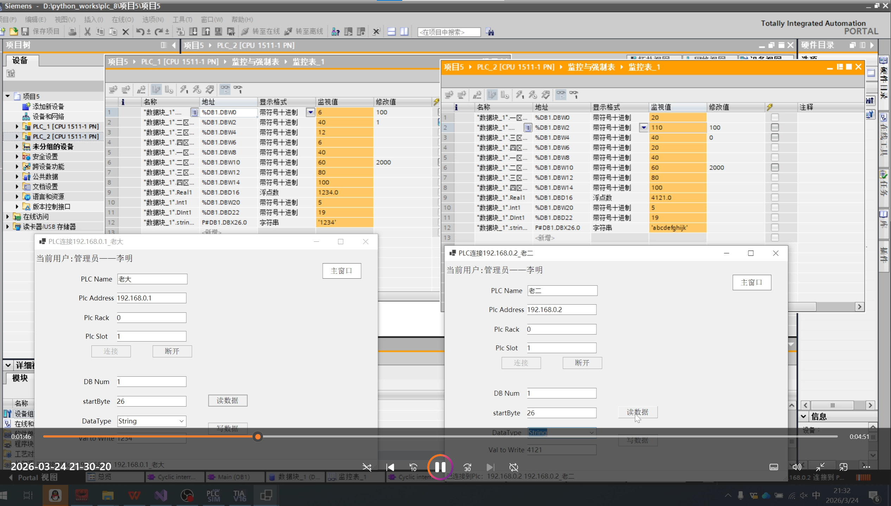
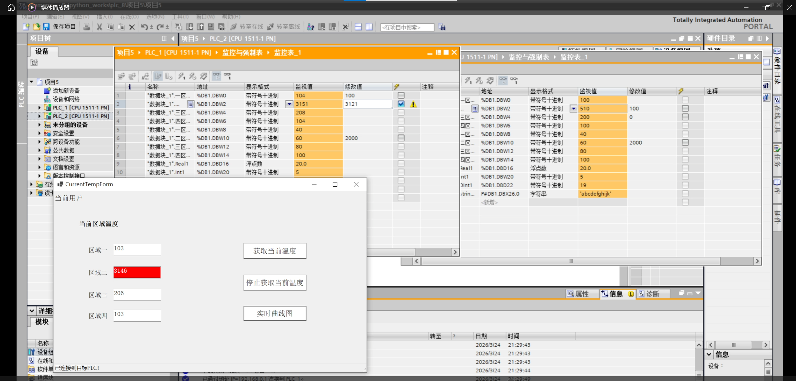
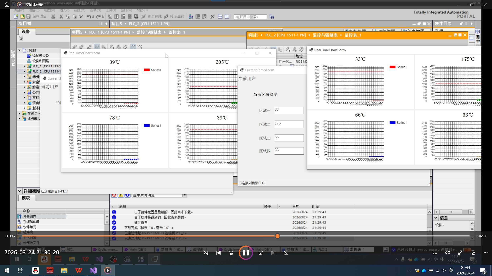
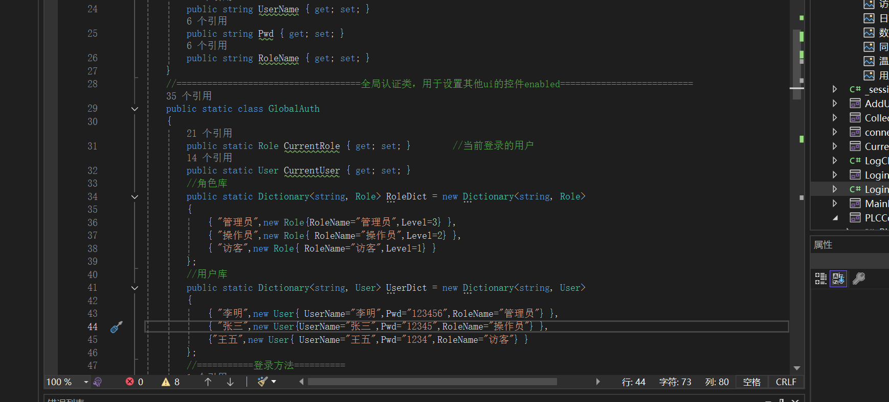
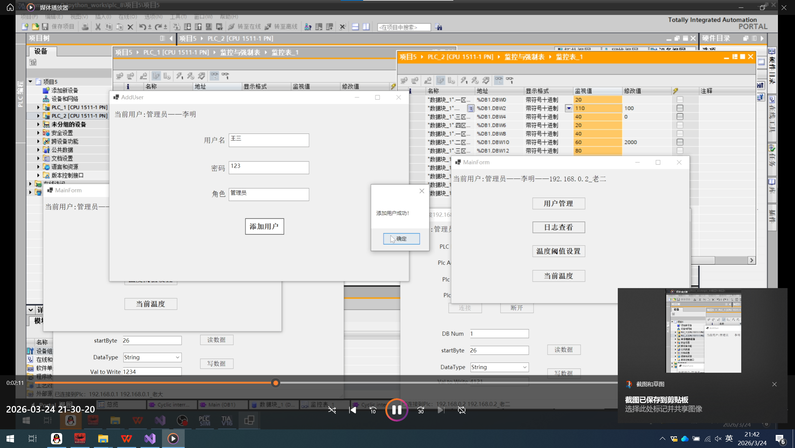
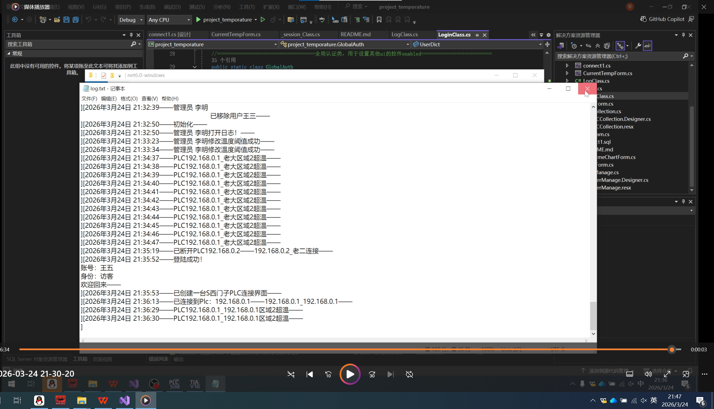
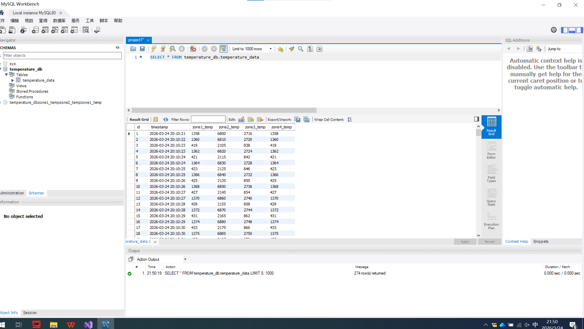
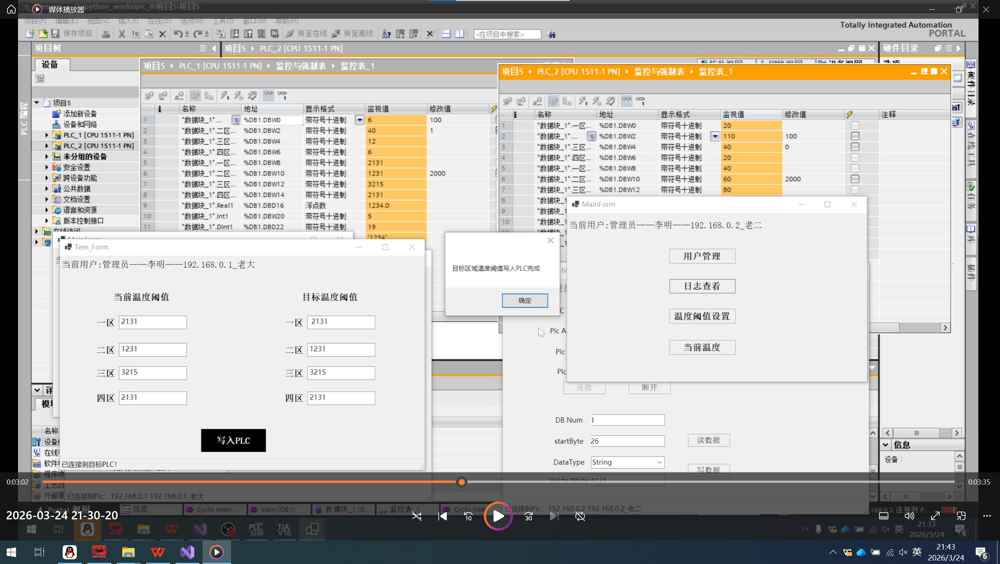
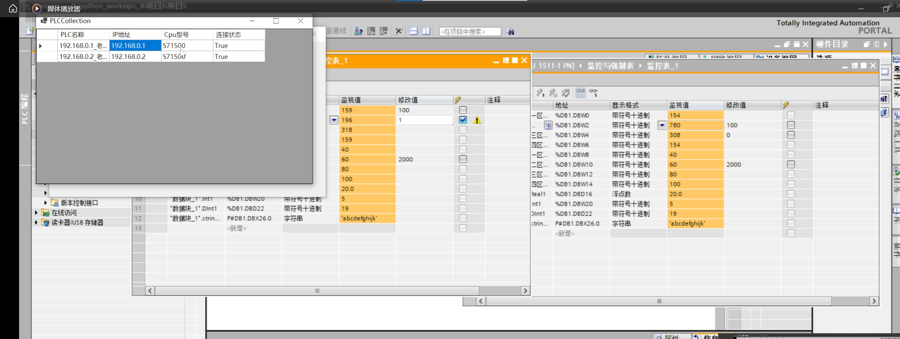

# 四区域温度检测上位机（支持多PLC同时连接）

基于 C# WinForms + S7.Net 开发的西门子PLC温度采集监控系统，支持多台PLC同时连接、实时温度监控、数据可视化、用户权限管理及数据持久化。
## 运行环境
项目 说明 

开发工具 ：Visual Studio 2022
开发框架 ：NET 6.0 
核心依赖库 ：MySql.Data (9.6.0)、S7.netplus (0.20.0)、WinForms.DataVisualization (1.10.0) 
适配PLC ： 西门子 S7-1500 
数据库 ： MySQL 

---

## 项目功能

### 1. PLC通信连接

支持通过IP地址连接多台西门子PLC，可对任意DB块及其任意字节偏移地址进行数据读写。通过 PlcSession类封装单台PLC连接，SessionManager静态类全局管理所有已连接的PLC会话。

### 2. 实时温度监控

显示四个区域的实时温度数据，支持温度阈值判断与报警。当温度超过设定阈值时，对应文本框背景变红；温度恢复正常后自动恢复原色。

### 3. 实时曲线绘制

使用 LinkedList<double>（双端队列）作为数据缓冲区，结合 DataVisualization 的 Chart 控件实现四个区域温度的实时曲线绘制，支持阈值线显示。

### 4. 用户权限管理

实现三级用户权限体系：
- 管理员：拥有所有权限，包括用户管理、日志查看、温度阈值设置、温度监控
- 操作员：可查看日志、修改温度阈值、查看温度监控
- 访客：仅可查看温度监控

### 5. 数据记录与日志

- 温度数据：通过 MySql.Data 库将四个区域的温度数据定时写入 MySQL 数据库（temperature_db.temperature_data 表）
- 操作日志：通过 LogControl 类将用户的关键操作记录到本地日志文件（log.txt），包括数据修改、超温报警、阈值修改、用户增删等事件

### 6. 多PLC并发管理

通过 SessionManager 维护一个全局的 Dictionary<string, PlcSession>，支持同时连接、管理和监控多台PLC设备，可在独立界面查看所有PLC的连接状态。

## 核心设计思路

- PlcSession：封装单台PLC的连接实例（Plc）、连接状态及对应的 TemperatureData，每个会话独立管理
- SessionManager：全局静态类，使用 Dictionary<string, PlcSession> 管理所有PLC连接，提供增删查操作
- TemperatureData：使用 LinkedList 双端队列作为环形缓冲区（默认120个数据点），存储时间和四个区域的温度数据，同时管理温度阈值和超温判断
- LogControl：静态工具类，将带时间戳的操作日志追加写入本地 log.txt 文件

##实际体验后的可优化点
1. 灵活性不足：四个温度检测区域的DB地址在代码中固定写死，扩展性较差。后续计划参照connect1界面的设计思路，允许用户自行配置每个区域的数据读取地址。
2. 写入效率偏低：当前温度数据逐条写入MySQL，高频采集场景下数据库IO压力较大。考虑引入批量写入或Redis缓存机制来优化，可行性仍需进一步验证。
3. 缺少退出登录功能：UI层面未实现退出登录流程，这是一个明显的功能缺失，后续需要补充完整的登录/退出会话管理。
4. 窗口生命周期管理存在隐患：实际测试中发现，关闭父窗口时若子窗口仍持有已销毁的实例引用，会导致程序崩溃。后续需优化窗口间的依赖关系和资源释放逻辑。
5. 协议扩展性有限：目前仅支持S7协议，后续计划使用interface定义统一的通信接口，以便扩展支持Modbus TCP等其他工业协议。
6. 连接健壮性不足：当前PLC连接仅尝试一次，网络波动时容易导致系统中断。后续计划实现自动重连机制，采用循环重试加退避策略提升稳定性。
7. 阈值同步问题：修改温度阈值后，若未打开设置窗口，当前温度监控界面无法获取最新阈值。后续计划使用delegate事件委托机制，实现阈值变更时主动通知相关界面更新。

